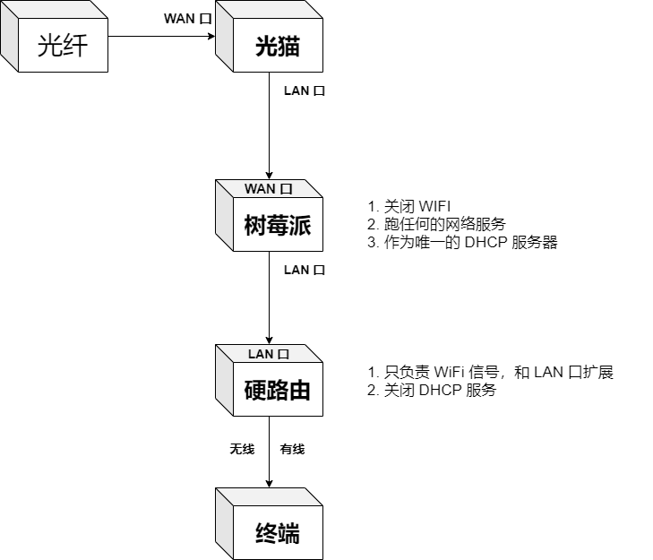
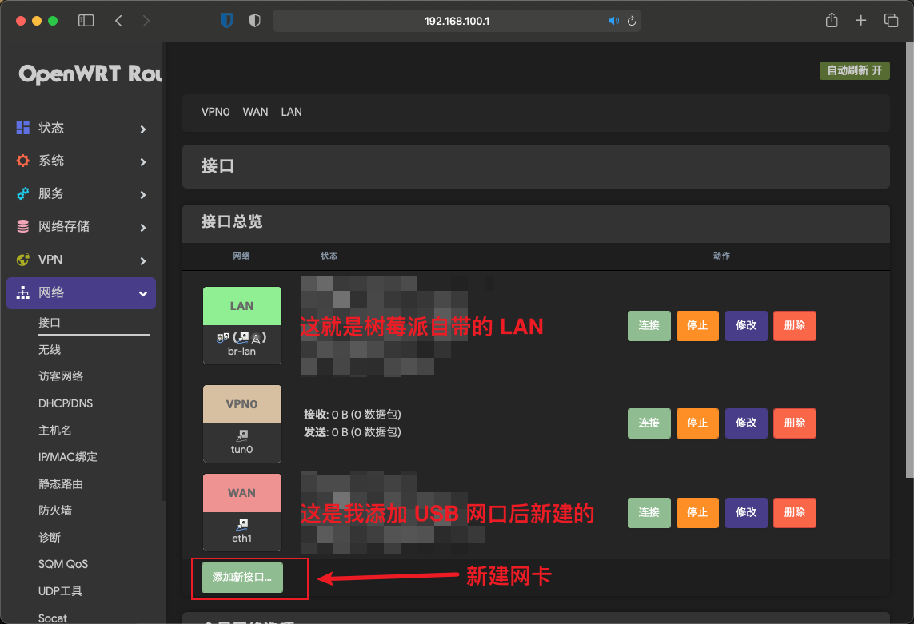
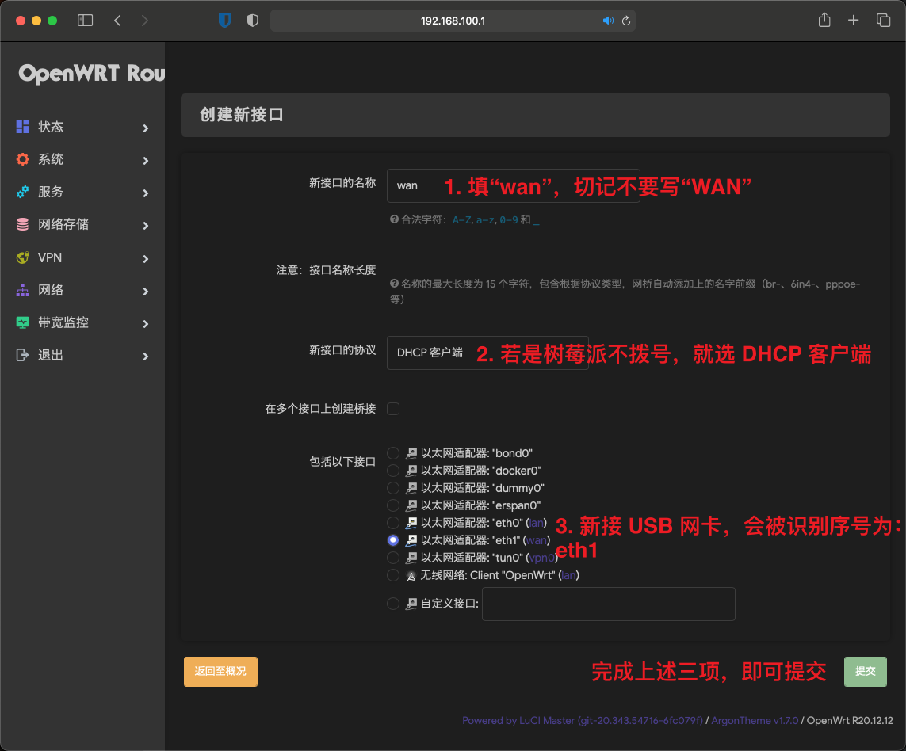
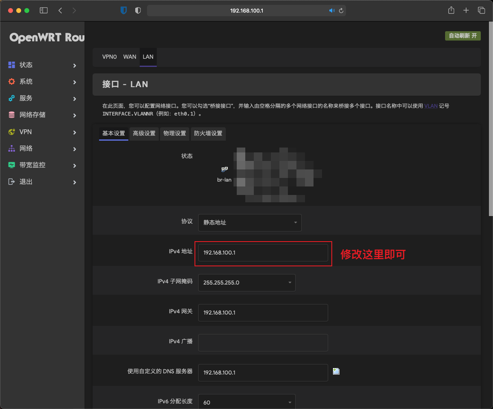
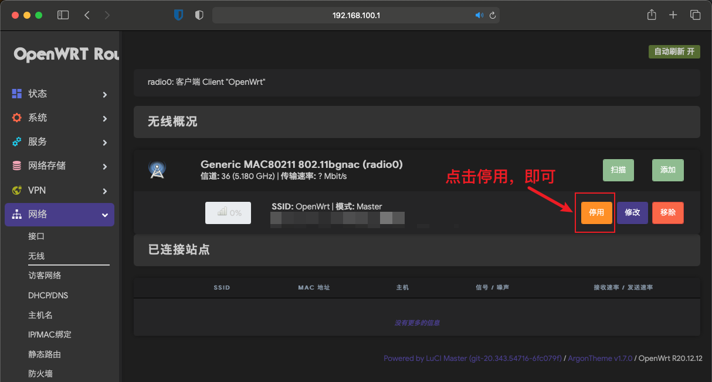

# openwrt-setup
Guidance on how to setup on openwrt and usable firmwares/images

## Basic Concept
Use OpenWRT as the main router and route all data to downstream wifi access point. The main concept should look like this

## Preparation
1. A device with two ethernet ports
2. If your device only has one port, get a USB to RJ45 converter. Watch out for the bandwidth on the RJ45 port
3. TF card or hard drive
4. [BalenaEtcher](https://etcher.balena.io/) to flash your image to disk

## Get In
1. Download the proper image for your hardware, you can refer it here: [Firmware table](https://openwrt.org/toh/views/toh_fwdownload). For example, Raspberry Pi 4 sits in bcm27xx-bcm2711
2. Flash the image into the TF card or disk
3. Put TF card or disk into your machine and boot
4. Wait for `OpenWrt` or simliar Wi-Fi pops up and connect
5. Log in to `192.168.1.1` or `192.168.10.1`, this depends on your firmware preset. 
6. Type `password` for password, also depends on the preset

## Configuration
1. Go to `Network` tab and add a new `WAN` interface

2. Check the config for your `LAN`, if its IP is `192.168.1.1`, change it to something else, such as `192.168.10.1`.
3. Make sure `IPV4 Addr`, `IPV4 Gateway`, and `Customized DNS` is changed altogether

4. Turn off original Wi-Fi on your device, so that we can save more power and make it more secure

5. It's all set! You should be abel to go now!

## Upgrade and Reinstall
1. Backup configurations from `System/Backup`
2. Flash [Restore.zip](./imgs/Restore-SDCard-4G.img.zip) first
3. Then flash your upgrade img or reinstall img

## Check speed
`ethtool eth1` and verify the `speed` is 100Mbps or 1000Mbps

## Reference
1. [在树莓派中运行 OpenWRT｜主路由模式 #1](https://github.com/QuentinHsu/Document-Page/issues/1)
2. [树莓派4B刷OpenWrt做路由器的经验+踩坑](https://zhuanlan.zhihu.com/p/451788328)
3. [SuLingGG/OpenWrt-RPI(已归档)](https://github.com/SuLingGG/OpenWrt-Rpi)
4. [bigbugcc/OpenWrts(云自动编译)](https://github.com/bigbugcc/OpenWrts)

## Image and Configuration
| Image       | Addr         | User | Password | Refer                                |
|-------------|--------------|------|----------|--------------------------------------|
| 2711-230614 | 192.168.10.1 | root | password | https://github.com/bigbugcc/OpenWrts |
